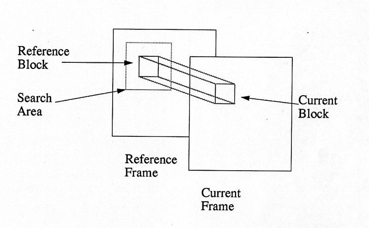
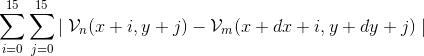
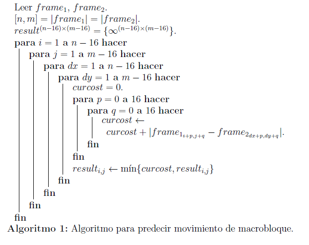

# Algoritmo de Vector de Movimiento

```
Jenny Quiroz Muñoz - jquirozm@eafit.edu.co
Julian Andres Sanchez Alzate - jsanch89@eafit.edu.co
Anderson Daniel Grajales Alzate - agrajal7@eafit.edu.co
```

## 1. Definición del problema

El algoritmo de compresión de video MPEG, utiliza una técnica conocida como Vectores de Movimiento, el cual le permite realizar la compresión temporal de frames P y B. [https://es.wikipedia.org/wiki/MPEG-2](https://es.wikipedia.org/wiki/MPEG-2). \
La técnica consiste en predecir hacia donde se mueven los macro-bloques (16 x 16 pixeles) de un frame i en el frame i+1. Se realiza una búsqueda hacia delante (frames P) y además hacía atrás (frames B). Para este ejercicio solo se realizará búsqueda hacia delante. \
 \
Cada macro-bloque se debe buscar en el frame siguiente en una región de búsqueda. Existen múltiples heurísticas para determinar la región de búsqueda. Para efectos de este problema, se tomará toda el frame i+1 como la región de búsqueda. \
 \
A continuación se presenta la función de similitud entre dos (2) macro-bloques: \
 \
Donde Vn  es el macro-bloque de referencia (en el frame i), Vm es el macro-bloque destino (en el frame i+1). dx y dy representan los desplazamiento en la región de búsqueda, por ejemplo, si dx=0 y dy=0, se está intentando hacer matching exactamente en la misma posición. \
El criterio para moverse dentro de la región de búsqueda, no es parte del estándar, para el caso de este ejercicio se utilizará búsqueda exhaustiva, es decir, en el peor de los casos (si no lo encuentra), se recorre toda la región de búsqueda con incrementos en dx y dy de un (1) pixel. \
<b>Criterio de parada</b>: cuando la función anterior es igual a cero (0), indica que ha encontrado el macro-bloque en el destino (frame i+1) y debería parar allí, si la función no es igual a cero (0), deberá encontrar el valor mínimo. Es decir, <b><i>Min</i></b> { <i>val-función en región búsqueda</i> }.
El resultado de la localización del macro-bloque de referencia en la región de búsqueda en el siguiente frame, será un una pareja (xi, yi) donde inicia el macrobloque en el frame destino(i+1).
### 1.1. Algoritmo

## 2. OpenMP
* [Algoritmo de ejecución con OpenMP](openmp.md)
## 3. MPI
* [Algoritmo de ejecución con MPI](mpi.md)
## 4. PCAM (Metodología) 
* [Algoritmo de ejecución con PCAM](pcam.md)
