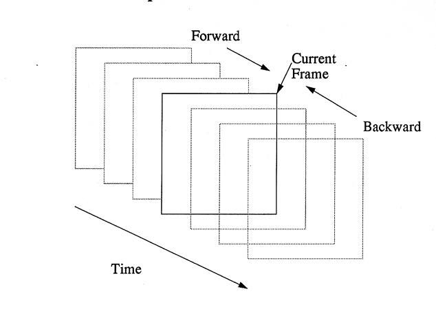

# Algoritmo de Vector de Movimiento

```
Jenny Quiroz Muñoz - jquirozm@eafit.edu.co
Julian Andres Sanchez Alzate - jsanch89@eafit.edu.co
Anderson Daniel Grajales Alzate - agrajal7@eafit.edu.co
```

## Definición del problema

El algoritmo de compresión de video MPEG, utiliza una técnica conocida como Vectores de Movimiento, el cual le permite realizar la compresión temporal de frames P y B. [https://es.wikipedia.org/wiki/MPEG-2](https://es.wikipedia.org/wiki/MPEG-2). \
La técnica consiste en predecir hacia donde se mueven los macro-bloques (16 x 16 pixeles) de un frame i en el frame i+1. Se realiza una búsqueda hacia delante (frames P) y además hacía atrás (frames B). Para este ejercicio solo se realizará búsqueda hacia delante.

# Módulos Usados:
```
  Numpy
  Pillow
```

# Serial (Ejecución)
Para ejecutar esta versión del algoritmo es necesario tener python 3.6.0 y los módulos anteriormente mencionados. Luego de asegurarse que están instalados, debe abrir la terminal o línea de comandos. Finalmente, ingrese a la carpeta serial y ejecute el comando: 

```
  python VectorDeMovimiento.py
```

