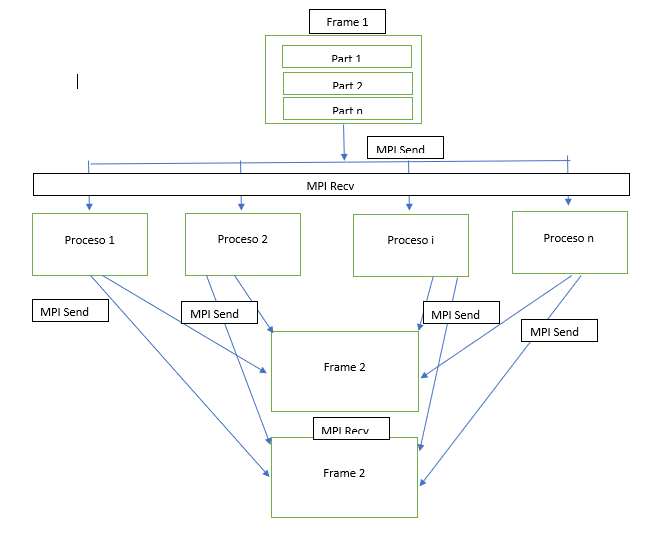

# Paralelización del algoritmo con MPI

De acuerdo a las posibilidades de paralelización ya previamente identificadas en [Análisis de Paralelización](pcam.md), entendimos que se podian usar las funciones [```Mpi Recv```](https://www.mpich.org/static/docs/latest/www3/MPI_Recv.html) y [```Mpi_Send```](https://www.mpich.org/static/docs/latest/www3/MPI_Send.html). Siendo asì, tendremos el siguiente diagrama respresentando la forma en que se usan ambas funciones para resolver el problema:

